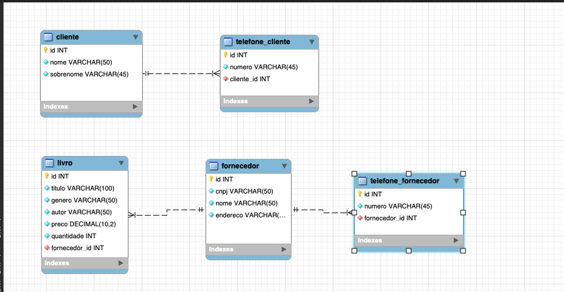

### Livraria SpringBoot

O objetivo desse projeto é desenvolver uma aplicação para livrarias/sebos, possibilitando com que o proprietário/funcionários possam gerenciar. Para isso
iremos fazer uso das seguintes tecnologias:

- Java
- SpringBoot
- JPA (Hibernate)
- Spring Security
- OAUTH2 + JWT

Iremos montar uma aplicaçãp fazendo uso das boas práticas adquiridas durante esses anos de experiência, iremos desenvolver usando conceitos como clean clode, arquitetura hexagonal, documentações, tudo que é
aconselhado a ser usado em um projeto da "vida real".

Schema do banco de dados proposto:

